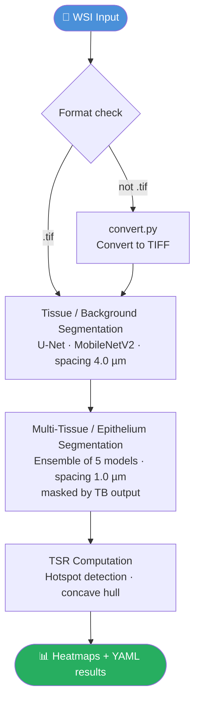
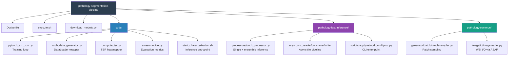
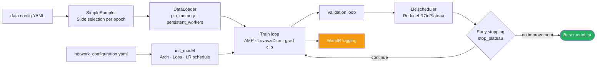

# Pathology Segmentation Pipeline

A Docker-based pipeline for training and deploying deep learning segmentation models on Whole Slide Images (WSI). Built around an asynchronous tile inference engine, it supports tissue/background segmentation, multi-tissue classification, epithelium segmentation, and tumour-stroma ratio (TSR) computation.


---

## Overview

The pipeline ingests a WSI and runs three sequential stages — tissue segmentation, epithelium/tumour segmentation, and TSR heatmap computation — entirely inside a GPU-enabled Docker container. Model weights are hosted on HuggingFace Hub and downloaded on demand, keeping the image lightweight.



---

## Repository Structure



---

## Inference Pipeline

### 1. Build the Docker image

```bash
docker build -t pathology-pipeline .
```

### 2. Download model weights from HuggingFace

```bash
# Download all model families
docker run --gpus all -it pathology-pipeline python3 /home/user/source/download_models.py all

# Or selectively
docker run --gpus all -it pathology-pipeline python3 /home/user/source/download_models.py tb
docker run --gpus all -it pathology-pipeline python3 /home/user/source/download_models.py multi-tissue
```

Mount a host directory to cache models across restarts:
```bash
docker run --gpus all \
  -v /host/path/models:/home/user/source/models \
  pathology-pipeline python3 /home/user/source/download_models.py all
```

### 3. Run inference on a WSI

```bash
docker run --gpus all \
  -v /path/to/data:/home/user/data \
  -v /path/to/output:/home/user/process \
  pathology-pipeline \
  bash /home/user/source/code/start_characterization.sh /home/user/data/slide.tif
```

Outputs are written to:

| Path | Content |
|------|---------|
| `/home/user/process/tb/` | Tissue / background masks |
| `/home/user/process/epithelium/` | Epithelium segmentation masks |
| `/home/user/process/tumor/` | Tumour masks |
| `/home/user/process/concave_hull_masks/` | Concave hull annotations |

---

## Training



### Configure

Edit `code/network_configuration.yaml`:

```yaml
model:
    modelname: 'unet'          # unet, unet-plus, manet, fpn, deeplabv3+, ...
    backbone: 'mobilenet_v2'
    loss: 'lovasz'             # lovasz, dice, cc
    learning_rate: 0.0001
training:
    epochs: 150
    stop_plateau: 100          # early stopping patience
    training_batch_size: 10
    mixed_precision: true
```

### Run training

```bash
python3 code/pytorch_exp_run.py \
  --project_name my_experiment \
  --data_path /path/to/data.yaml \
  --config_path code/network_configuration.yaml \
  --output_path /path/to/output
```

At startup you will be prompted to confirm or change the segmentation architecture:

```
Available architectures:
  [1] unet  ← current
  [2] unet-plus
  [3] manet
  [4] linknet
  [5] fpn
  ...
```

Training progress is displayed with Rich live progress bars and a per-epoch summary:

```
Epoch   5/150  train_loss=0.3241  val_loss=0.2841  val_iou=0.7456  lr=1.00e-04  [2m]  ✓ new best
Epoch   6/150  train_loss=0.3312  val_loss=0.2901  val_iou=0.7423  lr=1.00e-04  [2m]  no improve 1/100
```

---

## Evaluation

`awesomedice.py` computes per-class and overall Dice / Jaccard scores by comparing segmentation masks against ground truth, with optional per-slide confusion matrices.

```bash
python3 code/awesomedice.py \
  --input_mask_path "/results/*.tif" \
  --ground_truth_path "/gt/{image}.tif" \
  --classes "{'background': 1, 'epithelium': 2, 'stroma': 3}" \
  --spacing 1.0 \
  --output_path /results/scores.yaml \
  --mapping "{'background': 1, 'epithelium': 2, 'stroma': 3}" \
  --all_cm
```

Results are printed as a Rich table:

```
┌────────────────────────────────┐
│     Evaluation results         │
├─────────────┬──────────────────┤
│ Class       │ F1 (overall)     │
├─────────────┼──────────────────┤
│ epithelium  │ 0.8234           │
│ stroma      │ 0.7891           │
│ All classes │ 0.8123           │
└─────────────┴──────────────────┘
```

---

## Model Weights

Pre-trained weights are hosted on HuggingFace Hub. Use `download_models.py` to fetch them (see above). To upload your own trained models:

```bash
python3 upload_models_to_hf.py
```

Edit the `CONFIGURATION` section at the top of the file before running.

---

## Key Dependencies

| Package | Version | Role |
|---------|---------|------|
| PyTorch | 2.4.1+cu124 | Model training and inference |
| ASAP | 2.2 Nightly | WSI file I/O |
| segmentation-models-pytorch | 0.3.4 | U-Net / UNet++ / FPN architectures |
| albumentations | 1.4.x | Training augmentation |
| wandb | 0.17.9 | Experiment tracking |
| rich | 13.7.1 | Training progress display |
| huggingface_hub | 0.24.6 | Model weight hosting |
| wholeslidedata | 0.0.15 | WSI utilities |

---

## License

MIT
